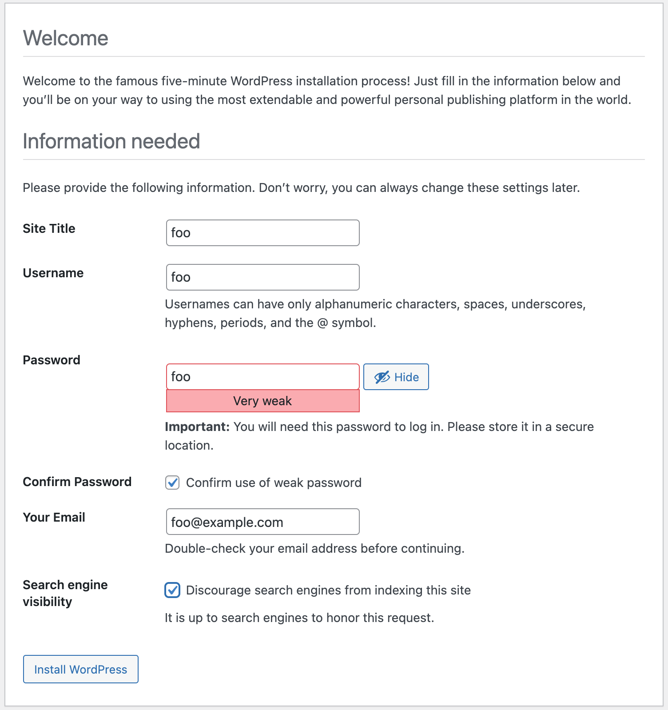

# How to use the new [Security Profiles Operator](https://github.com/kubernetes-sigs/security-profiles-operator)

This is a demo on how to use the [Security Profiles Operator](https://github.com/kubernetes-sigs/security-profiles-operator) to

  1. [Bootstrap](#bootstrap)
  1. [Record Syscalls](#record-syscalls)
  1. [Collect a seccomp profile](#collect-a-seccomp-profile)
  1. [Start a workload with that Seccomp Profile](#start-a-workload-with-that-seccomp-profile)
  1. [Prove that the seccomp profile is enforcing](#prove-that-the-seccomp-profile-is-enforcing)
  1. [Put that all together to something less contrived, package it all up and deploy to a fresh cluster](#put-that-all-together-to-something-less-contrived)

I'm going to demo this using Docker Desktop for a mac, this is a common enough developer environment, things might be a lot easier for you if you're using a linux machine with auditd/syslog enabled, but since the vm that Docker Desktop doesn't ship with that running, we'll have to run our own.

I ran into all sorts of issues trying to get auditd/syslog to work in a container and use KiND / k3d / minikube, appears to be do with not being able to match up the pid namespaces, so the log-enricher wouldn't work.

It might be possible with podman machine, or some other magic to use the ebpf or cri-o hook based recording, but I couldn't for the life of me get that to work. Believe me I tried, I've lost dozens of hours with very late nights to this already.

> Show me the code.

## Bootstrap

> This assumes you're using docker (inc Docker Desktop), Podman and podman machine requires a few tweaks, I've added these as comments and suffixed the line with `PODMAN ONLY` and `PODMAN MACHINE ONLY` where necessary you'll need to just uncomment these lines

### Start a KiND cluster

You need to mount force the `/proc` to be mounted through to the nodes, if you have multiple nodes you'll need to add the `extraMounts` section to each node

```bash
# export KIND_EXPERIMENTAL_PROVIDER=podman                           # PODMAN ONLY
# podman machine init --cpus=4 --memory=8096                         # PODMAN MACHINE ONLY
# podman machine start                                               # PODMAN MACHINE ONLY
# podman system connection default podman-machine-default-root       # PODMAN MACHINE ONLY

kind create cluster --config - << EOF
apiVersion: kind.x-k8s.io/v1alpha4
kind: Cluster
name: kind
networking:
#  apiServerAddress: "0.0.0.0"                                       # PODMAN ONLY
nodes:
  - role: control-plane
    image: kindest/node:v1.23.3
    extraMounts:
    - hostPath: /proc
      containerPath: /hostproc
EOF

# sed -i '' 's/https:\/\/:/https:\/\/localhost:/g' ~/.kube/config    # PODMAN ONLY
```

### Deploy a syslog controller (and wait for it to be ready)

> Podman and Docker desktop use a vm that doesn't ship with syslog or auditd which you'll need to write write the logs for the log enricher to then collect, this needs to be deployed as a DaemonSet across the cluster. You may be able to skip this step if you're using a linux workstation or podman which can use eBPF. 

```bash
kubectl apply -k github.com/chrisns/syslog-auditd # PODMAN ONLY

kubectl --namespace kube-system wait --for condition=ready pods -l name=syslogd # PODMAN ONLY

```

### Deploy cert manager (and wait for it to be ready)

```bash
kubectl apply -f https://github.com/jetstack/cert-manager/releases/download/v1.6.1/cert-manager.yaml
kubectl --namespace cert-manager wait --for condition=ready pod -l app.kubernetes.io/instance=cert-manager
```

### Deploy [Security Profiles Operator](https://github.com/kubernetes-sigs/security-profiles-operator) (and wait for it to be ready)

```bash
kubectl apply -f https://raw.githubusercontent.com/kubernetes-sigs/security-profiles-operator/main/deploy/operator.yaml
kubectl --namespace security-profiles-operator wait --for condition=ready ds name=spod
```

### Use our custom proc mount and enable the log enricher in the SecurityProfilesOperatorDaemon (SPOD) and wait for it to be ready

```bash
kubectl --namespace security-profiles-operator patch spod spod --type=merge -p '{"spec":{"hostProcVolumePath":"/hostproc"}}'
kubectl --namespace security-profiles-operator patch spod spod --type=merge -p '{"spec":{"enableLogEnricher":true}}' # DOCKER DESKTOP ONLY
# kubectl --namespace security-profiles-operator patch spod spod --type=merge -p '{"spec":{"enableBpfRecorder":true}}' # PODMAN / LINUX HOST ONLY
kubectl --namespace security-profiles-operator wait --for condition=ready pod -l name=spod
```

## Record Syscalls

```shell
$ kubectl apply -f https://raw.githubusercontent.com/appvia/security-profiles-operator-demo/main/demo-recorder.yaml

$ kubectl run my-pod --image=nginx --labels app=demo && kubectl wait --for condition=ready --timeout=-1s pod my-pod && kubectl delete pod my-pod
pod/my-pod created
pod/my-pod condition met
pod "my-pod" deleted

$ kubectl run --rm -it my-pod --image=alpine --labels app=demo -- sh
If you don't see a command prompt, try pressing enter.
/ # ls
bin    dev    etc    home   lib    media  mnt    opt    proc   root   run    sbin   srv    sys    tmp    usr    var
/ # exit
Session ended, resume using 'kubectl attach my-pod -c my-pod -i -t' command when the pod is running
pod "my-pod" deleted
```

## Collect a seccomp profile

You'll now have a profile thats ready to use (note it is only aggregated and created when the pod exits)

We can check what that looks like with and export it to keep it in our version control
`kubectl neat get sp demo-recorder-my-pod -o yaml`  should give you a yaml that looks like:
> I'm using [kubectl-neat](https://github.com/itaysk/kubectl-neat) to make the output less verbose

```yaml
apiVersion: security-profiles-operator.x-k8s.io/v1beta1
kind: SeccompProfile
metadata:
  labels:
    spo.x-k8s.io/profile-id: SeccompProfile-demo-recorder-my-pod
  name: demo-recorder-my-pod
  namespace: default
spec:
  architectures:
  - SCMP_ARCH_AARCH64
  defaultAction: SCMP_ACT_ERRNO
  syscalls:
  - action: SCMP_ACT_ALLOW
    names:
    - brk
    - capget
    - capset
    - chdir
    - clone
    - close
    - epoll_ctl
    - execve
    - exit_group
    - fchown
    - fcntl
    - fstat
    - fstatfs
    - futex
    - getcwd
    - getdents64
    - geteuid
    - getpgid
    - getpid
    - getppid
    - getuid
    - ioctl
    - lseek
    - madvise
    - mmap
    - mprotect
    - munmap
    - nanosleep
    - newfstatat
    - openat
    - ppoll
    - prctl
    - read
    - rt_sigaction
    - rt_sigprocmask
    - rt_sigreturn
    - set_tid_address
    - setgid
    - setgroups
    - setpgid
    - setuid
    - wait4
    - write
    - writev
```

## Start a workload with that Seccomp Profile

> For shorthand we're gonna use `--overrides` to force in some extra things to the podspec

```bash
$ kubectl run --rm -ti my-pod --image=alpine  --overrides='{ "spec": {"securityContext": {"seccompProfile": {"type": "Localhost", "localhostProfile": "operator/default/demo-recorder-my-pod.json"}}}}' -- sh
/ # ls
bin    dev    etc    home   lib    media  mnt    opt    proc   root   run    sbin   srv    sys    tmp    usr    var
/ # exit
Session ended, resume using 'kubectl attach my-pod -c my-pod -i -t' command when the pod is running
pod "my-pod" deleted
```

Ok, so we've not broken anything!

## Prove that the seccomp profile is enforcing

### Without the seccomp profile

```
$ kubectl run --rm -ti my-pod --image=alpine -- sh
If you don't see a command prompt, try pressing enter.

/ # mkdir foo
/ # touch bar
/ # rm /etc/alpine-release
/ # ping -c 1 1.1.1.1
PING 1.1.1.1 (1.1.1.1): 56 data bytes
64 bytes from 1.1.1.1: seq=0 ttl=37 time=20.657 ms

--- 1.1.1.1 ping statistics ---
1 packets transmitted, 1 packets received, 0% packet loss
round-trip min/avg/max = 20.657/20.657/20.657 ms
/ # nslookup google.com
Server:		10.96.0.10
Address:	10.96.0.10:53

Non-authoritative answer:
Name:	google.com
Address: 142.250.187.238

Non-authoritative answer:
Name:	google.com
Address: 2a00:1450:4009:81f::200e
/ # wget -q 1.1.1.1
/ # exit
Session ended, resume using 'kubectl attach my-pod -c my-pod -i -t' command when the pod is running
pod "my-pod" deleted
```

### All looks normal and permissive, now lets try the same thing with our profile

```bash
$ kubectl run --rm -ti my-pod --image=alpine  --overrides='{ "spec": {"securityContext": {"seccompProfile": {"type": "Localhost", "localhostProfile": "operator/default/demo-recorder-my-pod.json"}}}}' -- sh
/ # mkdir foo
mkdir: can't create directory 'foo': Operation not permitted
/ # touch bar
touch: bar: Operation not permitted
/ # rm /etc/alpine-release
rm: remove '/etc/alpine-release'? y
rm: can't remove '/etc/alpine-release': Operation not permitted
/ # ping -c 1 1.1.1.1
PING 1.1.1.1 (1.1.1.1): 56 data bytes
ping: permission denied (are you root?)
/ # nslookup google.com
nslookup: socket(AF_INET,2,0): Operation not permitted
/ # wget -q 1.1.1.1
wget: socket(AF_INET,1,0): Operation not permitted
```


Cool, so we're pretty trapped, but this is quite a contrived example, lets try with something a bit more real

## Put that all together to something less contrived

We'll deploy [Wordpress](https://www.wordpress.org) which needs [MySQL](https://mysql.org)/[MariaDB](https://mariadb.org/) and we'll also throw in [phpMyAdmin](https://www.phpmyadmin.net/) for 'fun'.

First lets deploy our recorder.

```bash
kubectl apply -f https://raw.githubusercontent.com/appvia/security-profiles-operator-demo/main/wordpress-recorder.yaml
```

Now lets deploy our apps

```bash
kubectl apply -k github.com/appvia/wordpress-kustomization-demo
kubectl wait --for condition=ready pod mysql-0
```

Now lets go to the wordpress gui and check

```bash
kubectl port-forward svc/wordpress 8080:http
```

Open a browser to http://localhost:8080

It doesn't really matter what config you give it, you're not going to keep this installation, you can imagine if this were your app, you might run your end to end tests right now.



Do some other things now, like create a blog post, upload images etc


Now lets try phpmyadmin

```bash
kubectl port-forward svc/phpmyadmin 8081:http
```

And go to it in the browser http://localhost:8081/?db=mydb&table=wp_posts which proves its all talking to one another, you can click around and do some other things like upload/download a file etc if you like.

Now lets delete our pods collect our profiles and stop recording

```bash
kubectl delete -k github.com/appvia/wordpress-kustomization-demo
kubectl delete -f https://raw.githubusercontent.com/appvia/security-profiles-operator-demo/main/wordpress-recorder.yaml

kubectl neat get sp wordpress-mysql -o yaml > mysql-seccomp-profile.yaml
kubectl neat get sp wordpress-phpmyadmin-0 -o yaml > phpmyadmin-seccomp-profile.yaml
kubectl neat get sp wordpress-wordpress-0 -o yaml > wordpress-seccomp-profile.yaml
```

Now we've got our profiles, we can either update our deployment code and include the seccomp profile with our infra code, or if perhaps this isn't in your control, perhaps its a public helm chart you've got no influence over you can use a Security Profiles Operator provided binding instead

```bash
kubectl apply -f - << EOF
apiVersion: security-profiles-operator.x-k8s.io/v1alpha1
kind: ProfileBinding
metadata:
  name: wordpress-wordpress
spec:
  profileRef:
    kind: SeccompProfile
    name: wordpress-wordpress-0
  image: wordpress:5.8.2-php7.4-apache
---
apiVersion: security-profiles-operator.x-k8s.io/v1alpha1
kind: ProfileBinding
metadata:
  name: wordpress-phpmyadmin
spec:
  profileRef:
    kind: SeccompProfile
    name: wordpress-phpmyadmin-0
  image: phpmyadmin:5.1.1-apache
---
apiVersion: security-profiles-operator.x-k8s.io/v1alpha1
kind: ProfileBinding
metadata:
  name: wordpress-mysql
spec:
  profileRef:
    kind: SeccompProfile
    name: wordpress-mysql
  image: mariadb:10.6.5-focal
EOF
```

If we look at the pods you'll find that the Security Profiles Operator has mutated the pod specs and injected something like:

```yaml
    securityContext:
      seccompProfile:
        localhostProfile: operator/default/wordpress-mysql.json
        type: Localhost
```

Now lets check it's all enforcing as we expect:

```shell
$ kubectl exec -ti deploy/phpmyadmin -- sh
# touch f
touch: setting times of 'f': Operation not permitted
# su
su: write error: Operation not permitted
```

Ok, so community products often require quite liberal access to kernel syscalls, but we can at least now monitor what they can do and be aware when the required permissions change.

It's worth noting that some recent [CVEs may been mitigated with even the default seccomp profile](https://blog.aquasec.com/cve-2022-0185-linux-kernel-container-escape-in-kubernetes)


<!--
## TODO

- [ ] github.com/chrisns/syslog-auditd readme
- [ ] github.com/appvia/auditd-container readme
- [ ] e2e tests on spo that demo the wordpress app
- [ ] add renovate to all repos to update readmes and yaml

-->
