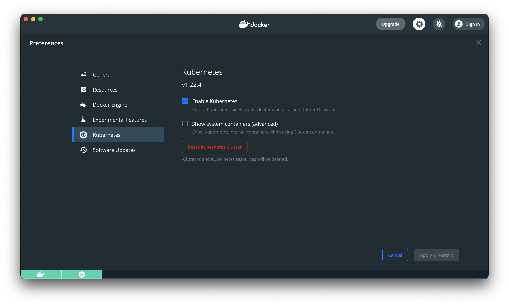

# How to use the new [Security Policy Operator](https://github.com/kubernetes-sigs/security-profiles-operator)

This is a demo on how to use the [Security Policy Operator](https://github.com/kubernetes-sigs/security-profiles-operator) to

  1. [Bootstrap](#bootstrap)
  1. [Record Syscalls](#record-syscalls)
  1. [Collect a seccomp profile](#collect-a-seccomp-profile)
  1. [Start a workload with that Seccomp Profile](#start-a-workload-with-that-seccomp-profile)
  1. [Prove that the seccomp profile is enforcing](#prove-that-the-seccomp-profile-is-enforcing)
  1. [Put that all together to something less contrived, package it all up and deploy to a fresh cluster](#put-that-all-together-to-something-less-contrived)

I'm going to demo this using Docker Desktop for a mac, this is a common enough developer environment, things might be a lot easier for you if you're using a linux machine with auditd/syslog enabled, but since the vm that Docker Desktop doesn't ship with that running, we'll have to run our own.

I ran into all sorts of issues trying to get auditd/syslog to work in a container and use KiND / k3d / minikube, appears to be do with not being able to match up the pid namespaces, so the log-enricher wouldn't work.

It might be possible with podman machine, or some other magic to use the ebpf or cri-o hook based recording, but I couldn't for the life of me get that to work. Believe me I tried, I've lost dozens of hours with very late nights to this already.

> Show me the code.

## Bootstrap

### Start Docker Desktop, and enable Kubernetes



### Deploy an auditd controller (and wait for it to be ready)

```bash
kubectl apply -k github.com/appvia/auditd-container
kubectl --namespace auditd wait --for condition=ready pod -l name=auditd
```

### Deploy cert manager (and wait for it to be ready)

```bash
kubectl apply -f https://github.com/jetstack/cert-manager/releases/download/v1.6.1/cert-manager.yaml
kubectl --namespace cert-manager wait --for condition=ready pod -l app.kubernetes.io/instance=cert-manager
```

### Deploy [Security Policy Operator](https://github.com/kubernetes-sigs/security-profiles-operator) (and wait for it to be ready)

```bash
kubectl apply -f https://raw.githubusercontent.com/kubernetes-sigs/security-profiles-operator/main/deploy/operator.yaml
kubectl --namespace security-profiles-operator wait --for condition=ready pod -l name=spod
```

### Enable the log enricher (and wait for it to be ready)

```bash
kubectl --namespace security-profiles-operator patch spod spod --type=merge -p '{"spec":{"enableLogEnricher":true}}'
kubectl --namespace security-profiles-operator wait --for condition=ready pod -l name=spod
```

## Record Syscalls

```shell
$ kubectl apply -f https://raw.githubusercontent.com/appvia/security-profiles-operator-demo/main/demo-recorder.yaml
$ kubectl run --rm -it my-pod --image=alpine --labels app=demo -- sh
If you don't see a command prompt, try pressing enter.
/ # ls
bin    dev    etc    home   lib    media  mnt    opt    proc   root   run    sbin   srv    sys    tmp    usr    var
/ # exit
Session ended, resume using 'kubectl attach my-pod -c my-pod -i -t' command when the pod is running
pod "my-pod" deleted
```

## Collect a seccomp profile

You'll now have a profile thats ready to use (note it is only aggregated and created when the pod exits)

We can check what that looks like with and export it to keep it in our version control
`kubectl neat get sp demo-recorder-my-pod -o yaml`  should give you a yaml that looks like:
> I'm using [kubectl-neat](https://github.com/itaysk/kubectl-neat) to make the output less verbose

```yaml
apiVersion: security-profiles-operator.x-k8s.io/v1beta1
kind: SeccompProfile
metadata:
  labels:
    spo.x-k8s.io/profile-id: SeccompProfile-demo-recorder-my-pod
  name: demo-recorder-my-pod
  namespace: default
spec:
  architectures:
  - SCMP_ARCH_AARCH64
  defaultAction: SCMP_ACT_ERRNO
  syscalls:
  - action: SCMP_ACT_ALLOW
    names:
    - brk
    - capget
    - capset
    - chdir
    - clone
    - close
    - epoll_ctl
    - execve
    - exit_group
    - fchown
    - fcntl
    - fstat
    - fstatfs
    - futex
    - getcwd
    - getdents64
    - geteuid
    - getpgid
    - getpid
    - getppid
    - getuid
    - ioctl
    - lseek
    - madvise
    - mmap
    - mprotect
    - munmap
    - nanosleep
    - newfstatat
    - openat
    - ppoll
    - prctl
    - read
    - rt_sigaction
    - rt_sigprocmask
    - rt_sigreturn
    - set_tid_address
    - setgid
    - setgroups
    - setpgid
    - setuid
    - wait4
    - write
    - writev
```

## Start a workload with that Seccomp Profile

> For shorthand we're gonna use `--overrides` to force in some extra things to the podspec

```bash
$ kubectl run --rm -ti my-pod --image=alpine  --overrides='{ "spec": {"securityContext": {"seccompProfile": {"type": "Localhost", "localhostProfile": "operator/default/demo-recorder-my-pod.json"}}}}' -- sh
/ # ls
bin    dev    etc    home   lib    media  mnt    opt    proc   root   run    sbin   srv    sys    tmp    usr    var
/ # exit
Session ended, resume using 'kubectl attach my-pod -c my-pod -i -t' command when the pod is running
pod "my-pod" deleted
```

Ok, so we've not broken anything!

## Prove that the seccomp profile is enforcing

### Without the seccomp profile

```
$ kubectl run --rm -ti my-pod --image=alpine -- sh
If you don't see a command prompt, try pressing enter.

/ # mkdir foo
/ # touch bar
/ # rm /etc/alpine-release
/ # ping -c 1 1.1.1.1
PING 1.1.1.1 (1.1.1.1): 56 data bytes
64 bytes from 1.1.1.1: seq=0 ttl=37 time=20.657 ms

--- 1.1.1.1 ping statistics ---
1 packets transmitted, 1 packets received, 0% packet loss
round-trip min/avg/max = 20.657/20.657/20.657 ms
/ # nslookup google.com
Server:		10.96.0.10
Address:	10.96.0.10:53

Non-authoritative answer:
Name:	google.com
Address: 142.250.187.238

Non-authoritative answer:
Name:	google.com
Address: 2a00:1450:4009:81f::200e
/ # wget -q 1.1.1.1
/ # exit
Session ended, resume using 'kubectl attach my-pod -c my-pod -i -t' command when the pod is running
pod "my-pod" deleted
```

### All looks normal and permissive, now lets try the same thing with our profile

```bash
$ kubectl run --rm -ti my-pod --image=alpine  --overrides='{ "spec": {"securityContext": {"seccompProfile": {"type": "Localhost", "localhostProfile": "operator/default/demo-recorder-my-pod.json"}}}}' -- sh
/ # mkdir foo
mkdir: can't create directory 'foo': Operation not permitted
/ # touch bar
touch: bar: Operation not permitted
/ # rm /etc/alpine-release
rm: remove '/etc/alpine-release'? y
rm: can't remove '/etc/alpine-release': Operation not permitted
/ # ping -c 1 1.1.1.1
PING 1.1.1.1 (1.1.1.1): 56 data bytes
ping: permission denied (are you root?)
/ # nslookup google.com
nslookup: socket(AF_INET,2,0): Operation not permitted
/ # wget -q 1.1.1.1
wget: socket(AF_INET,1,0): Operation not permitted
```


Cool, so we're pretty trapped, but this is quite a contrived example, lets try with something a bit more real

## Put that all together to something less contrived

We'll deploy a wordpress helm chart. run some requests through it to create a profiles and then we'll apply the profiles and then prove it is enforcing.


> if you want to reset your kubernetes cluster, or start from this point, then just play the bootrapping section up to and including [Enable the log enricher](#enable-the-log-enricher-and-wait-for-it-to-be-ready)
 
```
helm repo add bitnami https://charts.bitnami.com/bitnami
helm install --wait my-wordpress bitnami/wordpress
TBC
```